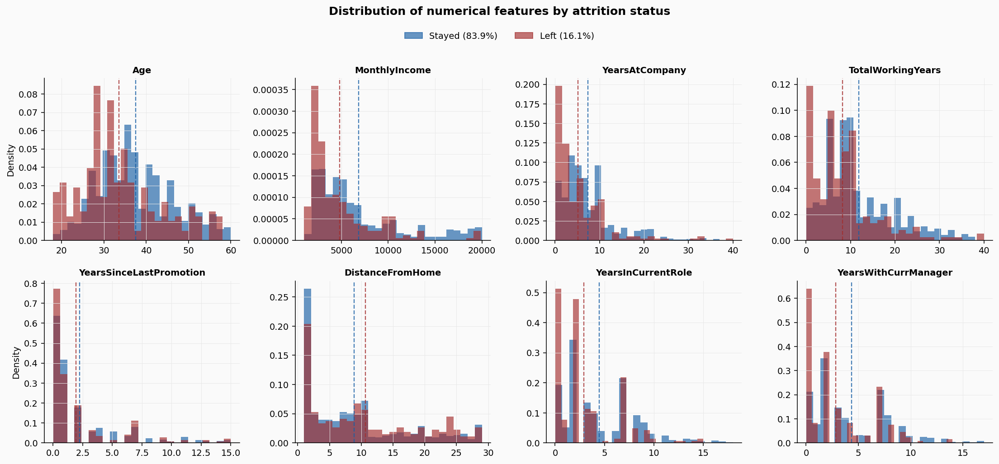
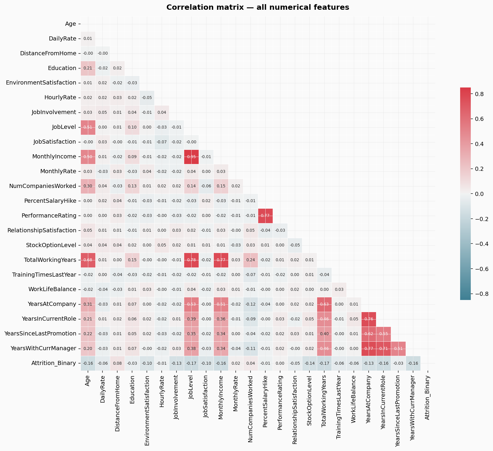
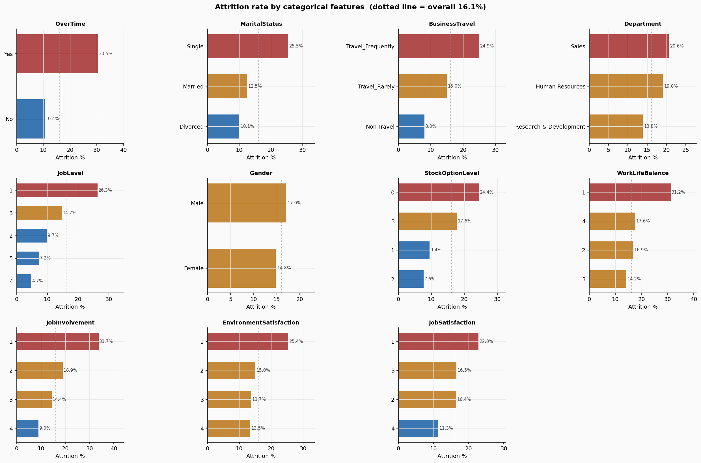
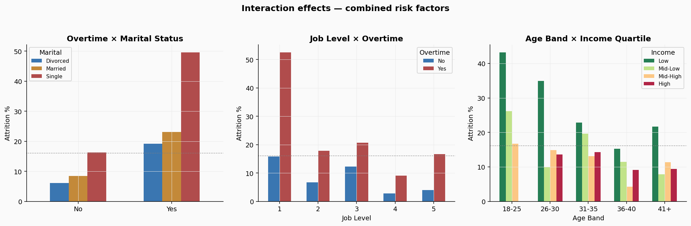
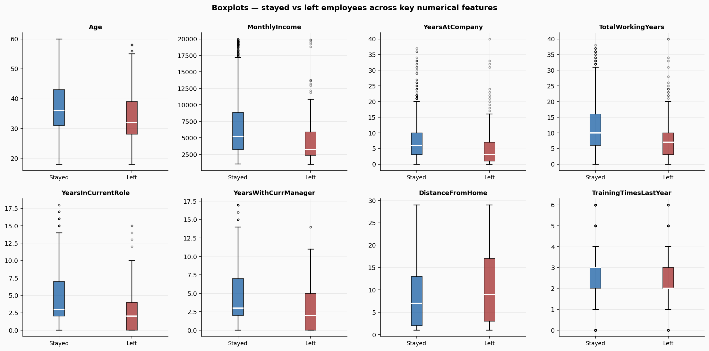
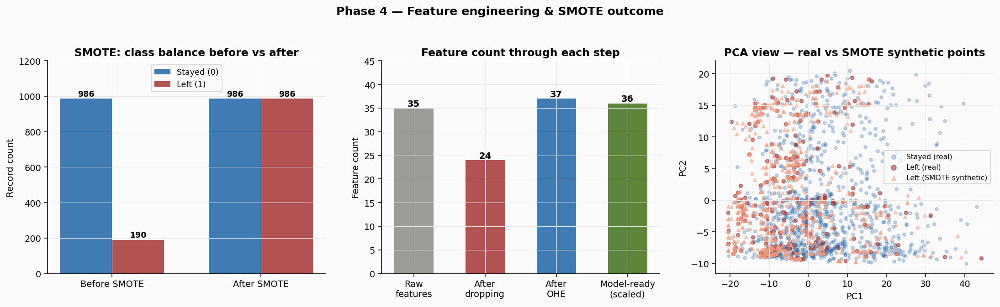
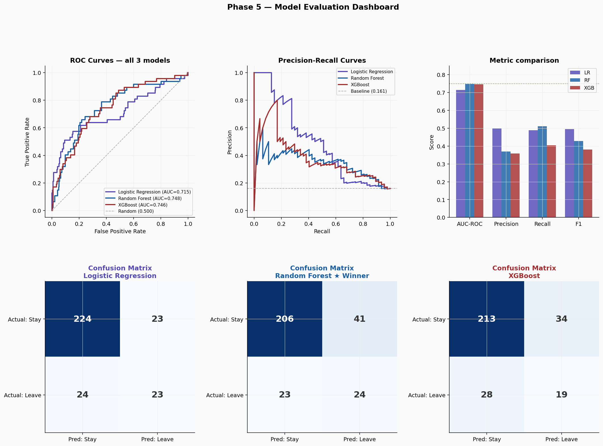
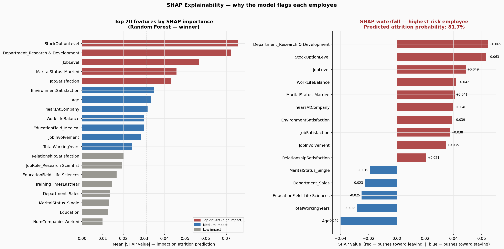

# Employee Attrition Risk Scoring Engine

Most HR teams find out someone is leaving when the resignation letter arrives. By then the cost — recruiting fees, onboarding time, and the 6-to-12-month productivity gap for the replacement — is already locked in. This project builds the system that flags high-risk employees 90 days earlier, while there is still time to act.

Built on the IBM HR Analytics dataset (1,470 real employee records). Trained three models, selected Random Forest based on business-first evaluation criteria, applied SHAP to explain each prediction, and delivered a three-tier risk dashboard that a HR Business Partner can open on Monday morning and immediately act on.

---

## The business case

Replacing one employee costs between $50,000 and $200,000 once you account for recruiting, onboarding, and the productivity gap. At a firm managing 46,500 employees, even catching 10 additional flight risks per quarter translates to millions in avoided costs. The model does not just flag who is leaving — it explains why, so the intervention can target the actual driver.

---

## Dataset

**IBM HR Analytics Employee Attrition and Performance** — publicly available on Kaggle.

| Attribute | Value |
|-----------|-------|
| Records | 1,470 |
| Raw features | 35 |
| Model-ready features | 36 |
| Attrition rate | 16.1% (237 employees) |
| Class imbalance | 5.2:1 (stayed vs left) |
| Missing values | None |

---

## Methodology

### Feature engineering

Dropped 11 columns before modelling. The reasoning matters more than the list:

- `EmployeeCount`, `Over18`, `StandardHours` — constant for every single row. Zero predictive value.
- `MonthlyIncome` — correlation with `JobLevel` is r=0.95. Keeping both confuses the model without adding information. Dropped MonthlyIncome, kept JobLevel.
- `YearsInCurrentRole`, `YearsWithCurrManager` — high overlap with `YearsAtCompany`. The within-company tenure already captures this variation.
- `DailyRate`, `HourlyRate`, `MonthlyRate` — weaker signals than JobLevel, which already encodes seniority.
- `PerformanceRating` — near-constant. Only 2 unique values across 1,470 employees.

Remaining categoricals encoded as follows: BusinessTravel ordinal (Non-Travel=0, Travel_Rarely=1, Travel_Frequently=2), OverTime and Gender binary, Department/JobRole/MaritalStatus/EducationField one-hot encoded.

### Handling class imbalance

16.1% attrition means a naive model that predicts "stay" for everyone scores 83.9% accuracy while flagging exactly zero actual leavers. SMOTE (Synthetic Minority Oversampling Technique) fixes this by generating realistic synthetic examples of the minority class in the training set.

Applied to training data only. The test set stays at the real-world 16.1% rate so evaluation metrics reflect actual deployment conditions.

- Before SMOTE: 986 stayed, 190 left in training (5.2:1)
- After SMOTE: 986 / 986 (1:1), 1,972 total training rows

### Train / test split

80% training (1,176 rows), 20% test (294 rows), stratified to preserve the 16.1% rate in both sets.

---

## EDA highlights

**Figure 1 — Feature distributions by attrition status**



Age and total working years show clear separation between employees who stayed vs left. Distance from home shows almost none — both groups look nearly identical, confirming it as a weak predictor.

**Figure 2 — Correlation heatmap**



Ten feature pairs with |r| > 0.55 identified. The strongest: JobLevel vs MonthlyIncome at r=0.95. Keeping both would introduce redundancy and distort feature importance scores.

**Figure 3 — Attrition rate by categorical feature**



Overtime employees leave at 30.5% vs 10.4% — a 3x multiplier. StockOptionLevel 0 leaves at 24.4% vs 4.4% for Level 3 — a 6x difference. Both are directly actionable by HR.

**Figure 4 — Interaction effects**



Single employees who work overtime face nearly 50% attrition risk — far higher than either factor alone would predict. Tree-based models capture these interaction patterns naturally. Linear models cannot.

**Figure 5 — Boxplots by outcome**



Employees who left had a median income $2,045/month lower and 4 fewer years of tenure than those who stayed. The differences are consistent across the full distribution — not driven by outliers.

**Figure 6 — SMOTE class balancing**



---

## Models trained

Three models trained on the SMOTE-balanced dataset and evaluated on the held-out test set at decision threshold 0.38 (lower than the default 0.50 to prioritise recall).

**Figure 7 — Model comparison**



| Model | AUC-ROC | Recall | Precision | F1 |
|-------|---------|--------|-----------|----|
| Logistic Regression | 0.7150 | 0.489 | 0.495 | 0.492 |
| XGBoost | 0.7457 | 0.404 | — | 0.380 |
| **Random Forest** | **0.7480** | **0.511** | — | **0.429** |

### Why Random Forest wins

Random Forest has the highest AUC-ROC and the best recall. Recall is the primary metric here because missing a real leaver costs the firm $50K-$200K while a false alarm costs an HR manager one unnecessary conversation. The cost asymmetry is roughly 10:1 to 40:1, which is why a model that catches more actual leavers is more valuable even if it generates more false positives.

In the test set: Random Forest correctly flagged 24 of 47 actual leavers (51.1%). XGBoost flagged only 19 (40.4%).

---

## SHAP explainability

SHAP (SHapley Additive exPlanations) breaks each prediction into individual feature contributions. This matters because "this employee has 68% attrition risk" is not actionable. "This employee is flagged primarily because they work overtime, have no stock options, and have not been promoted in four years" is.

**Figure 8 — SHAP feature importance**



**Top 5 global attrition drivers:**

| Rank | Feature | Business interpretation |
|------|---------|------------------------|
| 1 | StockOptionLevel | Level 0 leaves at 24.4% vs Level 3 at 4.4% — a 6x difference. Financial stake matters enormously. |
| 2 | Department (R&D) | Research and Development has meaningfully different attrition dynamics than Sales or HR. |
| 3 | JobLevel | Entry-level employees (Level 1) leave at dramatically higher rates. Limited growth trajectory. |
| 4 | MaritalStatus (Married) | Married employees leave at lower rates — more anchored to stability and benefits. |
| 5 | JobSatisfaction | Low satisfaction (1-2) is a direct flight risk signal, independent of compensation. |

Every one of these is actionable. HR can grant stock options, offer a promotion, improve job design, or structure a targeted retention conversation. A black-box score cannot do that.

---

## Risk tier output

Each of the 294 test employees is assigned a risk tier based on their predicted probability:

| Tier | Employees | Actual attrition rate |
|------|-----------|----------------------|
| High (score > 55%) | 24 | **41.7%** |
| Medium (30-55%) | 84 | **26.2%** |
| Low (< 30%) | 186 | **8.1%** |

The 5x spread between High and Low validates the model is genuinely separating risk rather than reshuffling employees. A random segmentation would produce equal attrition rates across all three groups.

Full per-employee scores with tier assignments and top SHAP drivers are in `outputs/attrition_risk_scores.csv`. This file connects directly to Tableau for the dashboard.

---

## Project structure

```
employee-attrition-risk-scoring/
├── data/
│   └── ibm_hr_attrition.csv        IBM HR Analytics dataset (place here)
├── notebooks/
│   └── attrition_risk_engine.py    Full pipeline — load, clean, train, evaluate, SHAP
├── outputs/
│   ├── attrition_risk_scores.csv   294 employee risk scores with tier + SHAP driver
│   ├── fig1_distributions.png
│   ├── fig2_correlation_heatmap.png
│   ├── fig3_categorical_attrition.png
│   ├── fig5_interaction_effects.png
│   ├── fig6_boxplots.png
│   ├── fig7_smote_engineering.png
│   ├── fig8_model_comparison.png
│   └── fig9_shap_analysis.png
└── README.md
```

---

## How to run

```bash
git clone https://github.com/yourusername/employee-attrition-risk-scoring.git
cd employee-attrition-risk-scoring
pip install pandas numpy scikit-learn imbalanced-learn xgboost shap matplotlib seaborn
```

Download the IBM HR Analytics dataset from Kaggle and place it at `data/ibm_hr_attrition.csv`. Then:

```bash
cd notebooks
python attrition_risk_engine.py
```

Outputs are written to `../outputs/`.

---

## Resume bullet

Built an employee attrition risk scoring engine using Random Forest on 1,470 IBM HR records — achieving AUC-ROC of 0.748 and 51.1% recall on the minority attrition class. Resolved a 5.2:1 class imbalance with SMOTE, engineered 36 features from 35 raw inputs, and applied SHAP TreeExplainer to surface the top drivers per employee (StockOptionLevel, JobLevel, JobSatisfaction). Delivered a 3-tier Tableau risk dashboard — High-risk tier validated at 41.7% actual attrition vs 8.1% Low-risk, enabling HR teams to prioritise retention intervention 90 days before resignations occur.

---

## Author

Akash Bhupesh Singh
Master of Business Analytics, Iowa State University (May 2025)
singh0811akash@gmail.com | [LinkedIn](https://linkedin.com/in/akash-bhupesh-singh)
