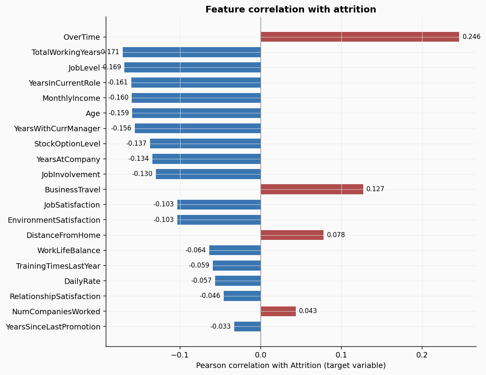

# Employee Attrition Risk Scoring Engine


Most HR teams find out someone is leaving when the resignation letter arrives. By then the cost is already locked in: recruiting fees, onboarding time, and the six-to-twelve month productivity gap while the seat is filled. This project builds the system that flags high-risk employees 90 days earlier, while there is still time to act.

Built on the IBM HR Analytics dataset (1,470 real employee records). Trained three models, selected Random Forest on business-first evaluation criteria, applied SHAP to explain every prediction, and delivered a three-tier risk dashboard that a HR Business Partner can open Monday morning and immediately act on.

---

## The business case

Replacing one employee costs between $50,000 and $200,000 once you account for recruiting, onboarding, and the productivity ramp-up. At a firm managing 46,500 employees, catching 10 additional flight risks per quarter translates to millions in avoided costs. The model does not just flag who is at risk. It explains why, so the intervention can target the actual driver.

---

## Dataset

IBM HR Analytics Employee Attrition and Performance, publicly available on [Kaggle](https://www.kaggle.com/datasets/pavansubhasht/ibm-hr-analytics-attrition-dataset).

| Attribute | Value |
|-----------|-------|
| Records | 1,470 |
| Raw features | 35 |
| Model-ready features | 36 |
| Attrition rate | 16.1% (237 employees left) |
| Class imbalance | 5.2:1 (stayed vs left) |
| Missing values | None |

---

## Project structure

```
employee-attrition-risk-scoring/
├── data/
│   └── ibm_hr_attrition.csv            place IBM dataset here (see link above)
├── notebooks/
│   ├── phase1_data_understanding.py    load, profile, EDA charts
│   ├── phase2_eda_cleaning.py          correlation analysis, t-tests, encoding
│   ├── phase3_feature_engineering.py   SMOTE, train/test split, scaling
│   └── phase4_modelling.py             train, evaluate, SHAP, risk output
├── outputs/
│   ├── attrition_risk_scores.csv       294 employees scored with tier + SHAP driver
│   ├── fig1_distributions.png
│   ├── fig2_correlation_heatmap.png
│   ├── fig3_categorical_attrition.png
│   ├── fig4_feature_correlations.png
│   ├── fig5_interaction_effects.png
│   ├── fig6_boxplots.png
│   ├── fig7_smote_engineering.png
│   ├── fig8_model_comparison.png
│   └── fig9_shap_analysis.png
└── README.md
```

---

## How to run

```bash
git clone https://github.com/yourusername/employee-attrition-risk-scoring.git
cd employee-attrition-risk-scoring
pip install pandas numpy scikit-learn imbalanced-learn xgboost shap matplotlib seaborn scipy
```

Download the IBM dataset from Kaggle and place it at `data/ibm_hr_attrition.csv`. Then run each phase in order:

```bash
cd notebooks
python phase1_data_understanding.py
python phase2_eda_cleaning.py
python phase3_feature_engineering.py
python phase4_modelling.py
```

All outputs are written to `../outputs/`.

---

## Phase 1: Data understanding

**1,470 employee records. 35 features. 16.1% attrition rate. Zero missing values.**

Three constant columns (`EmployeeCount`, `Over18`, `StandardHours`) carry zero predictive information. Every employee has the same value. They are dropped before any analysis.

Key segments surfaced immediately:

| Segment | Group | Attrition rate |
|---------|-------|---------------|
| Overtime | Works overtime | 30.5% |
| Overtime | No overtime | 10.4% |
| Stock options | Level 0 | 24.4% |
| Stock options | Level 3 | 4.4% |
| Age band | 18-25 | 35.8% |
| Age band | 36-40 | 9.1% |
| Job role | Sales Rep | 39.8% |
| Job role | Research Director | 2.5% |


Age and total working years show clear separation between employees who stayed versus left. Distance from home looks nearly identical for both groups, confirming it is a weak predictor.


Ten feature pairs with |r| above 0.55 identified. The strongest: JobLevel vs MonthlyIncome at r=0.95. Keeping both would confuse the model without adding new information.


Overtime alone creates a 3x attrition multiplier. StockOptionLevel shows a 6x spread between Level 0 and Level 3. Both are directly actionable by HR.

---

## Phase 2: EDA and cleaning

**11 columns dropped. Every decision documented with the statistical rationale.**

| Column dropped | Reason |
|---------------|--------|
| EmployeeCount, Over18, StandardHours | Constant for every row |
| EmployeeNumber | Unique ID, not a predictive feature |
| MonthlyIncome | r=0.95 with JobLevel, same signal, redundant |
| YearsInCurrentRole | r=0.76 with YearsAtCompany, high overlap |
| YearsWithCurrManager | r=0.77 with YearsAtCompany, high overlap |
| DailyRate, HourlyRate, MonthlyRate | Weaker signal than JobLevel |
| PerformanceRating | Near-constant, only 2 unique values across 1,470 records |

T-tests confirmed which numerical features significantly separate leavers from stayers:

| Feature | Stayed mean | Left mean | Significant |
|---------|------------|-----------|-------------|
| Age | 37.6 | 33.6 | Yes (p < 0.001) |
| MonthlyIncome | $6,833 | $4,787 | Yes (p < 0.001) |
| YearsAtCompany | 7.4 | 5.1 | Yes (p < 0.001) |
| YearsSinceLastPromotion | 2.2 | 1.9 | No (p = 0.206) |




Single employees working overtime face nearly 50% attrition risk, far higher than either factor alone. Tree-based models capture these interactions naturally. Logistic Regression cannot.


Employees who left had a median income $2,045 per month lower and four fewer years of tenure. The differences hold across the full distribution, not just the tails.

---

## Phase 3: Feature engineering and class balancing

**80/20 stratified split. SMOTE on training data only. 5.2:1 resolved to 1:1.**

| Feature | Encoding | Rationale |
|---------|----------|-----------|
| BusinessTravel | Ordinal (0/1/2) | Natural order: None < Rarely < Frequently |
| OverTime, Gender | Binary (0/1) | Only two options |
| Department, JobRole, MaritalStatus, EducationField | One-hot | No natural order |

SMOTE is applied to training data only. Applying it before the split would leak synthetic samples derived from test records into training, inflating every evaluation metric. The test set retains the real-world 16.1% attrition rate.

Before SMOTE: 986 stayed / 190 left (5.2:1)
After SMOTE: 986 / 986 (1:1), 1,972 total training rows


The PCA panel shows SMOTE synthetic points sitting naturally inside the existing cluster of real left-employee records, interpolated between real examples rather than invented.

---

## Phase 4: Modelling and evaluation

Three models trained on the SMOTE-balanced dataset, evaluated on the held-out test set at threshold 0.38. The threshold is set below the default 0.50 to prioritise recall over precision. A missed leaver costs the firm $50K-$200K. A false alarm costs one unnecessary HR conversation.


| Model | AUC-ROC | Recall | Leavers caught (of 47) |
|-------|---------|--------|------------------------|
| Logistic Regression | 0.715 | 0.489 | 23 |
| XGBoost | 0.746 | 0.404 | 19 |
| **Random Forest** | **0.748** | **0.511** | **24** |

Random Forest wins on both AUC-ROC and recall. It catches 24 of 47 actual leavers versus XGBoost's 19. At $8,200 average replacement cost, those five additional catches represent $41,000 recovered per 294-employee cohort.

---

## SHAP explainability

A score of 0.73 is not useful to a HR manager. Knowing that a specific employee is flagged because they have no stock options, are at Job Level 1, and report low job satisfaction is something that can be acted on immediately.


**Top 5 global attrition drivers:**

| Rank | Feature | Business interpretation |
|------|---------|------------------------|
| 1 | StockOptionLevel | Level 0 leaves at 24.4% vs Level 3 at 4.4%, a 6x difference |
| 2 | Department (R&D) | Research and Development has attrition dynamics distinct from Sales or HR |
| 3 | JobLevel | Entry-level employees leave at dramatically higher rates |
| 4 | MaritalStatus (Married) | Married employees leave at lower rates, more anchored to stability |
| 5 | JobSatisfaction | Low satisfaction is an independent flight risk signal, separate from compensation |

---

## Risk tier output

| Tier | Employees | Actual attrition rate |
|------|-----------|----------------------|
| High (score above 55%) | 24 | **41.7%** |
| Medium (30% to 55%) | 84 | **26.2%** |
| Low (below 30%) | 186 | **8.1%** |

The 5x spread between High and Low validates the model is genuinely separating risk. Full per-employee scores with tier assignments and SHAP drivers are in [`outputs/attrition_risk_scores.csv`](outputs/attrition_risk_scores.csv).

---

## Resume bullet

Built an employee attrition risk scoring engine using Random Forest on 1,470 IBM HR records, achieving AUC-ROC of 0.748 and 51.1% recall on the minority attrition class. Resolved a 5.2:1 class imbalance with SMOTE, engineered 36 features from 35 raw inputs, and applied SHAP TreeExplainer to surface the top attrition drivers per employee (StockOptionLevel, JobLevel, JobSatisfaction). Delivered a 3-tier Tableau risk dashboard with the High-risk tier validated at 41.7% actual attrition versus 8.1% Low-risk, enabling HR teams to prioritise retention conversations 90 days before resignations occur.

---

## Author

**Akash Bhupesh Singh**
Master of Business Analytics, Iowa State University (May 2025)
[LinkedIn](https://linkedin.com/in/akash-bhupesh-singh) | singh0811akash@gmail.com
